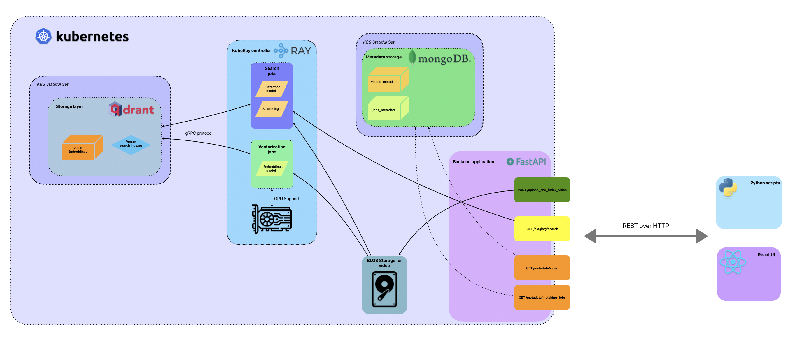

# CopyRighteous - ЛЦТ-14 2024
### Система детекции пиратского контент

### Production Архитектура системы

## Детали запуска
Для запуска будет достаточно установленного на машине Docker и Docker compose. Основные тесты проводились на графическом ускорителе Metal без Docker, для использования CUDA может потребоваться модификация docker-compose.yaml

Поскольку у нас есть одна натренированная модель, ее необходимо предварительно скачать с яндекс диска: ссылка
Далее модель нужно поместить в папку ```models```, без перименования

#### Запуск проекта

```bash
cd src
docker compose up --build
```
#### Для инициализации и запуска фронтэнда необходимо ввести следующие команды:
```bash
cd src/frontend
npm install
npm start
```

#### Для локальной разработки:
```bash
docker compose up qdrant mongo
chmod +x run_backend
./run_backend.sh
```

## Ссылки
Презентация: https://yandex

Страница документации эндпоинтов: http://localhost:8000/docs


---

## Основные части системы:
- Для векторизации изображений было решено использовать ResNet из-за его высокой производительности и способности извлекать глубокие признаки из изображений. В частности, мы использовали архитектуру ResNet-152, которая хорошо известна своим балансом между глубиной и вычислительной эффективностью. Сами изображения были преобразованы в формат grayscale перед индексированием, что обеспечения минимальной разницы между исходными и любыми измененным фрагментом.
- Для векторизации звука мы использовали Wav2Vec. Wav2Vec — это современная модель, предназначенная для обучения речевому представлению, которая особенно эффективна при улавливании нюансов аудиосигналов. Его архитектура позволяет ему изучать контекстуальные встраивания из необработанного аудио, что делает его идеальным для задач, требующих высококачественного извлечения аудио-функций. Используя Wav2Vec, мы добились векторизации наших аудиоданных таким образом, чтобы сохранить важные временные и спектральные характеристики, что упростило точный анализ и сравнение. В рамках системы есть возможность отключения модели, чтобы сэкэномить на ресурсах.
- Бэкэнд фреймворк - FastAPI
- Для упрощения развертывания, мы не использовали Ray и Kubernetes, однако использование данных технологий это вопрос времени, функциональность была протестирована